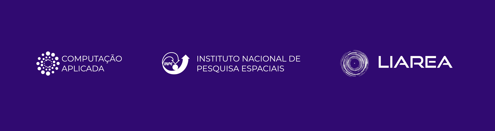

# Workshop de Introdução em Aprendizado Profundo aplicado em Sensoriamento Remoto

O minicurso tem como objetivo apresentar os conceitos fundamentais de deep learning (DL) e sua aplicação no processamento e análise de dados de sensoriamento remoto (SR), com foco em imagens de satélite e séries temporais. Durante a sessão, serão exploradas abordagens de aprendizado de máquina supervisionado, não supervisionado e por reforço, conectando-as a cenários práticos como classificação de imagens, análise de mudanças ambientais por meio de séries temporais. Este material é desenvolvido exclusivamente pelo Lab LIAREA para o GeoInfo 2025. 

## Mãos na massa!

Após uma introdução teórica super interessante, vamos brincar e trabalhar com problemas reais enfrentados no que diz respeito ao treinamento de modelos de DL. 

### #1 Aprendizado Supervisionado
No tocante ao aprendizado supervisionado, comumente direcionado para tarefas de classificação/segmentação semântica, um dos principais desafios, além da escassez de conjunto de imagens rotulados, é o desbalanceamento da quantidade de dados rotulados. Para este caso de estudo, iremos utilizar U-Net de Cite que vai ser treinada no CerraData-3, um conjunto de dados sobre o bioma Cerrado. Para acessar o experimento siga as instruções a seguir:

- Faça login na sua conta Google
- Acesse o notebook (Versão Completa para Download): https://colab.research.google.com/drive/1a18_EpUZy7CFhFTCdTt_F8VPmvHs6LLC?usp=sharing 
- Ative a GPU:T4
- Baixe o dataset, na linha onde:
   ```
   import kagglehub
    
   # Download latest version
   path = kagglehub.dataset_download("cerranet/cerradatav31-for-semantic-segmentation")
    
   print("Path to dataset files:", path)
   ```
- Acesse o notebook e faça uma cópia para seu Google Drive: https://colab.research.google.com/drive/11_ppENw1693OyKvPwW0AYaW2yxhdhWN_?usp=sharing 
  
### #2 Aprendizado Não supervisionado

A seleção criteriosa de amostras de treinamento é uma etapa fundamental para o sucesso de modelos de aprendizado supervisionado aplicados à classificação de imagens de satélite. Amostras rotuladas de forma incorreta ou com baixa capacidade discriminatória podem comprometer significativamente o desempenho dos classificadores. Ao lidar com grandes regiões geográficas, é comum que a variabilidade natural, como diferenças fenológicas da vegetação, introduza ruído nas amostras, tornando a definição de classes complexa e com limites indefinidos.

Neste contexto, o pacote `sits` oferece um conjunto de ferramentas para controle de qualidade das amostras de treinamento, incluindo a técnica não supervisionada de Mapas Auto-Organizáveis (em inglês, Self-Organizing Maps, SOM), que permite detectar amostras ruidosas ou inconsistentes. Para acessar o experimento siga as instruções a seguir:

- Faça login na sua conta Google
- Acesse o notebook e faça uma cópia para seu Google Drive: https://colab.research.google.com/drive/1pg_OVYenJHO06grIBLIFZdgaTIRnpdVR?usp=sharing

### #3 Games
Para reforçar o conteúdo trabalhado neste workshop, preparamos um game Q&A em grupo. Aquele que chegar em primeiro lugar leva um prêmio de participação. Acesse o game em: https://kahoot.it/
